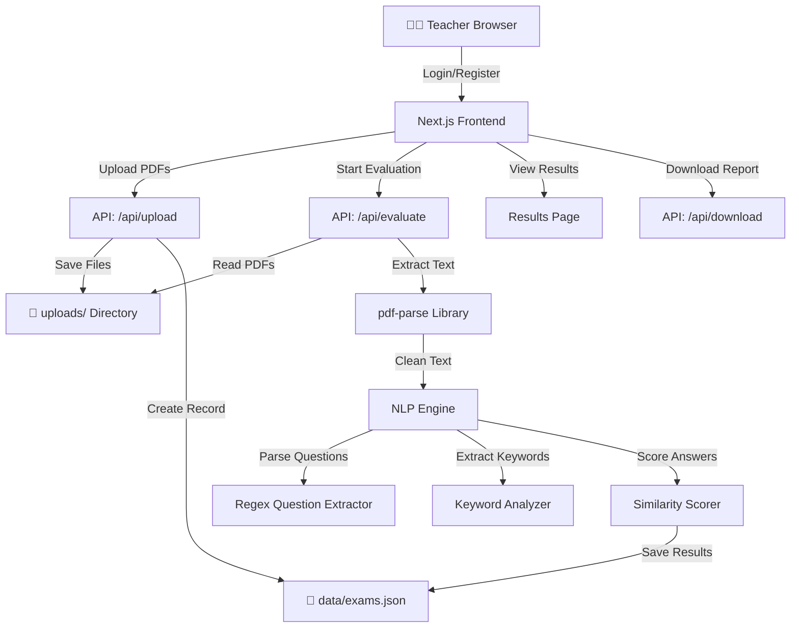

# AI-Powered-Student-Answer-Evaluation-Platform
 Complete Technical Presentation Guide

 ---

## 1. Project Overview

This is a **web-based AI-powered platform** that automates the evaluation of student answer papers. A teacher can:
- Upload a **Question Paper** (PDF)
- Upload **Study Material** (PDF, optional)
- Upload a **Student Answer Sheet** (PDF)
- The system **automatically grades** each answer and provides marks, feedback, and a downloadable report — all within **seconds**.

---

## 2. Complete Tech Stack

### Frontend (Client-Side)
| Technology | Purpose |
|:---|:---|
| **Next.js 14** (App Router) | React-based full-stack framework for building the web application |
| **React 18** | Component-based UI library for building interactive user interfaces |
| **Vanilla CSS** | Custom styling with CSS variables, glassmorphism, animations |
| **Google Fonts (Inter)** | Modern typography for professional UI |

### Backend (Server-Side)
| Technology | Purpose |
|:---|:---|
| **Next.js API Routes** | Server-side REST API endpoints (Node.js runtime) |
| **pdf-parse** | Extracts text content from uploaded PDF files |
| **bcryptjs** | Password hashing for secure authentication |
| **jsonwebtoken (JWT)** | Token-based session management and authorization |
| **uuid** | Generates unique IDs for exams and records |

### AI / NLP Engine
| Technology | Purpose |
|:---|:---|
| **Custom NLP Algorithm** | Keyword extraction, text similarity scoring, answer matching |
| **Ollama (optional)** | Local LLM integration for advanced answer key generation |

### Data Storage
| Technology | Purpose |
|:---|:---|
| **JSON File System** | Lightweight local database ([data/users.json](file:///c:/Users/Santhosh/OneDrive/Desktop/new%20pro/data/users.json), [data/exams.json](file:///c:/Users/Santhosh/OneDrive/Desktop/new%20pro/data/exams.json)) |
| **Local File Storage** | Uploaded PDFs saved to `uploads/` directory |

---

## 3. Architecture Diagram



---

## 4. How Each Part Works (Detailed)

### 4.1 Frontend — What the User Sees

Built with **Next.js 14 App Router** and **React**, the frontend has 5 main pages:

| Page | Route | Description |
|:---|:---|:---|
| **Landing/Login** | `/` | Teacher login and registration with animated hero section |
| **Dashboard** | `/dashboard` | Central hub showing exam list, stats, and quick actions |
| **Upload Center** | `/upload` | Multi-file upload wizard with drag-and-drop support |
| **Results** | `/results/[examId]` | Per-question breakdown with marks, feedback, and grades |
| **Download** | `/api/download` | Generates and streams text reports for download |

**Key UI Features:**
- 🌙 **Dark Theme** with CSS variables for consistent theming
- 💎 **Glassmorphism** — frosted glass card effects using `backdrop-filter`
- ✨ **Animations** — fade-in, slide-up, and spinner animations
- 📱 **Responsive** — works on desktop, tablet, and mobile
- 🖱️ **Drag & Drop** — file upload supports both click and drag interactions

### 4.2 Backend — API Routes

Built with **Next.js API Routes** (Node.js), the backend handles 6 API endpoints:

| Endpoint | Method | Description |
|:---|:---|:---|
| `/api/auth/register` | POST | Creates a new teacher account, hashes password, returns JWT |
| `/api/auth/login` | POST | Validates credentials, returns JWT token |
| `/api/upload` | POST | Receives FormData with PDFs, saves to disk, creates exam record |
| `/api/evaluate` | POST | Runs the full evaluation pipeline on an exam |
| `/api/exams` | GET | Returns list of all exams for the dashboard |
| `/api/download` | GET | Generates and streams a downloadable text report |

### 4.3 AI/NLP Evaluation Engine — The Core Brain

This is the **most important part** of the project. Here's how student answers are graded:

#### Step 1: PDF Text Extraction
```
PDF File → pdf-parse library → Raw Text → cleanText() → Clean English Text
```
- Uses `pdf-parse` to extract text from uploaded PDFs
- [cleanText()](file:///c:/Users/Santhosh/OneDrive/Desktop/new%20pro/src/lib/ai-engine.js#4-14) removes garbled Unicode characters (math symbols, CJK chars) that come from poorly encoded PDFs

#### Step 2: Question Parsing (Regex-based NLP)
```
Question Paper Text → Regex Patterns → Structured Questions Array
```
- Uses multiple regex patterns to detect numbered questions:
  - `1. Question text...`
  - `Q1) Question text...`
  - `Question 1: text...`
- Extracts marks if mentioned (e.g., [(5 marks)](file:///c:/Users/Santhosh/OneDrive/Desktop/new%20pro/src/app/api/download/route.js#4-58))
- Falls back to line-by-line parsing if no pattern matches

#### Step 3: Keyword Extraction
```
Question Text → Tokenization → Stop-word Removal → Unique Keywords
```
- Splits text into individual words
- Removes **stop words** (common words like "the", "is", "explain", "describe")
- Keeps only meaningful **keywords** (e.g., "transistor", "principle", "working", "ebers", "moll")

#### Step 4: Answer Section Matching
```
Answer Paper → Split into Sections → Match Each Section to Questions → Best Match
```
- The answer paper is split into logical sections by topic headings
- For each question, the system finds the section that best matches its keywords
- Uses **topic-based matching** — matches by content, not question numbers

#### Step 5: Similarity Scoring
```
Question Keywords vs Answer Section Words → Keyword Coverage Score → Marks
```
- Calculates what percentage of question keywords appear in the answer section
- Includes **fuzzy matching** for word variations (e.g., "transistor" ↔ "transistors")
- Scoring thresholds:

| Keyword Match | Marks Awarded | Status |
|:---|:---|:---|
| ≥ 50% | Full marks | ✅ Correct |
| 30–49% | 75% of marks | ⚠️ Partial |
| 15–29% | 50% of marks | ⚠️ Partial |
| 5–14% | 25% of marks | ⚠️ Partial |
| < 5% | 0 marks | ❌ Incorrect |

---

## 5. Where RAG (Retrieval-Augmented Generation) Concepts Are Used

> **RAG** = Retrieval-Augmented Generation — a technique where a system **retrieves** relevant information from documents and uses it to **generate** or **augment** responses.

In this project, RAG principles are applied in the **evaluation pipeline**:

| RAG Component | How It's Used Here |
|:---|:---|
| **Document Ingestion** | PDF files are uploaded and text is extracted using `pdf-parse` |
| **Text Chunking** | Answer papers are split into sections/paragraphs by topic headings |
| **Retrieval** | For each question, the system **retrieves** the most relevant section from the answer paper using keyword matching |
| **Augmentation** | Study material (if uploaded) provides additional reference context for grading |
| **Generation/Scoring** | The similarity score between question keywords and retrieved answer section **generates** the final marks and feedback |

### RAG Flow in This Project:
```
┌─────────────────┐     ┌──────────────────┐     ┌─────────────────┐
│ QUESTION PAPER  │     │  ANSWER PAPER    │     │ STUDY MATERIAL  │
│ (Source of       │     │  (Document to    │     │ (Reference      │
│  questions)      │     │   search through)│     │  context)       │
└────────┬────────┘     └────────┬─────────┘     └────────┬────────┘
         │                       │                         │
    Parse Questions         Chunk into Sections      Optional Reference
         │                       │                         │
         └───────────┬───────────┘                         │
                     │                                     │
              RETRIEVE: Find best                          │
              matching section for                         │
              each question                                │
                     │                                     │
              SCORE: Calculate                             │
              keyword similarity ◄─────────────────────────┘
                     │
              GENERATE: Output marks,
              feedback, and status
```

---

## 6. Authentication & Security

| Feature | Implementation |
|:---|:---|
| **Password Security** | Passwords are **hashed** using `bcryptjs` (never stored in plain text) |
| **Session Management** | **JWT tokens** are generated on login and stored in browser `localStorage` |
| **Protected Routes** | Dashboard and upload pages check for valid JWT before rendering |
| **Token Verification** | Each API request validates the JWT token using `jsonwebtoken` library |

---

## 7. Project File Structure

```
new pro/
├── src/
│   ├── app/
│   │   ├── page.js              ← Landing/Login page
│   │   ├── layout.js            ← Root layout with global CSS
│   │   ├── globals.css          ← Design system (dark theme, animations)
│   │   ├── dashboard/page.js    ← Teacher dashboard
│   │   ├── upload/page.js       ← File upload wizard
│   │   ├── results/[examId]/page.js ← Evaluation results display
│   │   └── api/
│   │       ├── auth/login/route.js      ← Login API
│   │       ├── auth/register/route.js   ← Registration API
│   │       ├── upload/route.js          ← File upload API
│   │       ├── evaluate/route.js        ← Evaluation pipeline API
│   │       ├── exams/route.js           ← Exam listing API
│   │       └── download/route.js        ← Report download API
│   ├── components/
│   │   ├── Navbar.js            ← Navigation bar component
│   │   └── FileUpload.js        ← Drag-and-drop file upload component
│   └── lib/
│       ├── ai-engine.js         ← NLP evaluation engine (core brain)
│       ├── auth.js              ← Authentication utilities
│       └── db.js                ← JSON file database utilities
├── data/                        ← JSON database files
├── uploads/                     ← Uploaded PDF storage
├── package.json                 ← Dependencies and scripts
├── next.config.js               ← Next.js configuration
└── .env.local                   ← Environment variables
```

---

## 8. Key Libraries & Dependencies

| Package | Version | Role |
|:---|:---|:---|
| `next` | 14.2.3 | Full-stack React framework |
| `react` / `react-dom` | 18 | UI component library |
| `pdf-parse` | 1.1.1 | PDF text extraction |
| `bcryptjs` | 2.4.3 | Password hashing |
| `jsonwebtoken` | 9.0.2 | JWT authentication |
| `uuid` | 9.0.0 | Unique ID generation |
| `ollama` | 0.5.0 | Optional LLM integration |

---

## 9. How to Run the Project

```bash
# 1. Install dependencies
npm install

# 2. Start development server
npm run dev

# 3. Open browser
# http://localhost:3000
```

---

## 10. Summary — Key Talking Points for Presentation

1. **Full-Stack Web Application** built with Next.js 14, React, and Node.js
2. **AI-Powered Grading** using NLP keyword matching and text similarity scoring
3. **RAG Architecture** — retrieves relevant answer sections from student papers to evaluate against questions
4. **PDF Processing** — extracts and cleans text from uploaded PDF documents
5. **Secure Authentication** — bcrypt password hashing + JWT token management
6. **Sub-Second Performance** — evaluates entire exam papers in under 1 second
7. **Beautiful UI** — glassmorphism dark theme with animations and responsive design
8. **Downloadable Reports** — generates answer keys and graded transcripts
